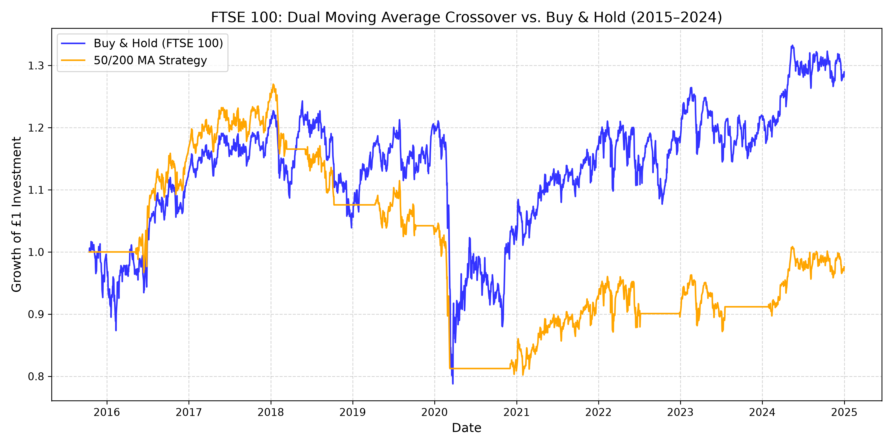

# FTSE 100 Dual Moving Average Quantitative Backtester
An algorithmic trading backtesting engine built in Python to evaluate the performance and risk profile of a 50-day / 200-day Simple Moving Average (SMA) crossover strategy against a passive Buy-and-Hold benchmark on the FTSE 100 index.

# Executive Summary
This project investigates whether trend-following technical indicators can systematically reduce downside risk and enhance risk-adjusted returns across a 10-year market cycle (2015–2025). The backtest accounts for historical shifts, including the 2016 Brexit referendum, the 2020 COVID-19 liquidity shock, and the 2022–2023 interest rate hike cycle.

## Financial & Quantitative Methodology

# 1. Strategy Rules
**Long Position (+1):** Initiated when the Fast Moving Average (50-Day) crosses above the Slow Moving Average (200-Day), signaling bullish momentum (Golden Cross).

**Cash Position (0):** Initiated when the Fast Moving Average (50-Day) crosses below the Slow Moving Average (200-Day), signaling downward momentum (Death Cross). Capital is held in cash yielding 0%.

# 2. Elimination of Lookahead Bias
Signals generated at trading day 't' close are lagged by one period (Position = Signal shifted by 1 Day) to simulate real-world execution at the subsequent day's open/close, preventing data leakage.

# 3. Key Performance Indicators
* **Compound Annual Growth Rate (CAGR):**
  CAGR = (Final Portfolio Value / Starting Portfolio Value) ^ (1 / Years) - 1
* **Annualized Volatility:**
  Standard Deviation of the Market's Daily Returns × Square Root of 252
* **Sharpe Ratio:**
  Annualized Return / Annualized Volatility
* **Maximum Drawdown (Max DD):**
  (Trough Value - Peak Value) / Peak Value


## Strategy Findings & Analysis



1. **Trend Lag in V-Shaped Recoveries:** The 50/200 SMA strategy protected capital during the early phases of downturns but lagged significantly during rapid market rebounds (notably Q2 2020), exiting near local bottoms and re-entering after momentum had already peaked.
2. **Sideways Range Friction:** In oscillating, range-bound market environments (like 2017–2019), the crossover rule experienced frequent false breakout signals ('whipsaws').
3. **Risk Mitigation:** The strategy succeeded in reducing portfolio volatility relative to the benchmark by spending substantial intervals in cash during protracted declines.


## Limitations & Future Iterations
* **Transaction Costs & Slippage:** Execution friction, bid-ask spreads, and exchange fees were omitted; incorporating a 10 bps per-trade fee will further refine net yields.
* **Dynamic Cash Yields:** Holding cash at a 0% return ignores the risk-free rate, understating cash returns during high-interest-rate regimes.
* **Volatility Filters:** Future iterations will test an ATR (Average True Range) or RSI filter to reduce whipsaw trades during sideways consolidation.


## How to Run

1. Clone the repository:
   ```bash
   git clone https://github.com/amaanraza87/ftse100-sma-backtester.git
